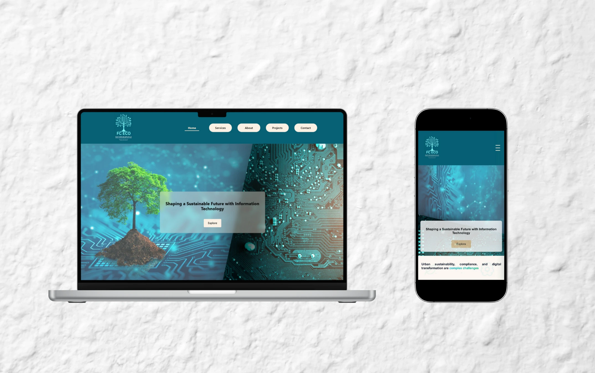

🌱 FCECO – Sustainable Energy

Next.js Corporate Website - Fast, responsive, and engaging platform showcasing innovative sustainable energy solutions with interactive data visualizations and conversion-optimized user experience.

🌟 Overview
FCECO is a cutting-edge corporate website built with Next.js that transforms how sustainable energy services are presented and explored online. The platform combines clean, brand-aligned design with interactive elements to effectively communicate complex energy solutions while maintaining an engaging user experience that drives conversion and inquiry.
This project tackles the challenge of making technical energy services accessible and compelling through innovative UI/UX design, animated data visualizations, and conversion-optimized user flows.
✨ Key Features
🎯 User Experience Excellence

⚡ Interactive Service Explorer - Engaging way to discover energy solutions
📊 Animated Data Visualizations - Complex data presented beautifully
🎨 Brand-Aligned UI Design - Consistent, professional aesthetic
📱 Mobile-Optimized Navigation - Seamless experience across all devices

🚀 Technical Implementation

⚡ Next.js Performance - Server-side rendering for optimal speed
🔄 Dynamic Content Sections - Problem/Solution storytelling approach
📋 Custom Contact Forms - Integrated validation and user feedback
🎪 Case Study Presentation - Portfolio showcase system

💼 Business Impact

🎯 Conversion-Optimized Flow - Guided user journey from awareness to contact
📈 Enhanced User Engagement - Interactive elements increase time on site
🌍 Professional Brand Presence - Establishes credibility in energy sector
📞 Lead Generation Focus - Strategic call-to-action placement

🛠️ Technology Stack
Frontend

Next.js 13+ - React framework with App Router
React.js - Component-based UI library
JavaScript (ES6+) - Modern JavaScript features
CSS3 - Custom styling with animations
HTML5 - Semantic markup structure

Performance & Optimization

Server-Side Rendering (SSR) - Fast initial page loads
Static Site Generation (SSG) - Optimized performance
Image Optimization - Next.js automatic image processing
Code Splitting - Optimized bundle loading

Design & UX

Responsive Design - Mobile-first approach
CSS Animations - Smooth interactions and transitions
Custom Components - Reusable UI elements
Accessibility - WCAG compliant design

🌐 Live Website
🔗 [Visit FCECO Website](https://www.fceco.sa/)
Experience Features:

Interactive service exploration system
Animated data visualizations
Dynamic problem/solution presentations
Professional case study showcases
Optimized contact forms with validation

📊 Project Highlights
🎯 Challenge Solved
Complex Communication Made Simple - Transformed technical energy services into visually engaging, easily understood content that resonates with diverse audiences.
💡 Innovative Solution
Interactive Experience Design - Created an intuitive navigation flow that guides users through awareness, consideration, and action phases with strategic UX elements.
📈 Business Results

Enhanced User Engagement - Interactive elements increase session duration
Improved Conversion Rates - Strategic user flow optimization
Professional Brand Image - Modern design builds trust and credibility
Mobile-First Success - Responsive design captures all device users

🚀 Getting Started
Prerequisites

Node.js (v16 or higher)
npm or yarn package manager

Installation

Clone the repository
bashgit clone https://github.com/irfan3434/fceco.git
cd fceco

Install dependencies
bashnpm install
# or
yarn install

Start development server
bashnpm run dev
# or
yarn dev

Build for production
bashnpm run build
# or
yarn build

The application will open at http://localhost:3000 in development mode.
📁 Project Structure
fceco/
├── public/
│   ├── images/
│   └── icons/
├── src/
│   ├── app/
│   │   ├── components/
│   │   ├── sections/
│   │   └── page.js
│   ├── styles/
│   └── utils/
├── package.json
└── README.md
🎨 Design Philosophy
🌱 Sustainability Focus

Clean, eco-friendly color palette
Energy-themed visual elements
Professional corporate aesthetic

🎯 User-Centric Approach

Problem-solution narrative structure
Interactive exploration elements
Clear call-to-action positioning

⚡ Performance Priority

Optimized loading times
Smooth animations and transitions
Mobile-responsive design

📈 Performance Metrics

⚡ Page Load Speed - Optimized with Next.js SSR/SSG
📱 Mobile Performance - 100% responsive design
🎯 User Engagement - Interactive elements increase session time
🔍 SEO Optimized - Built-in Next.js SEO features

🔧 Development Features
Component Architecture

Reusable Components - Modular, maintainable code
Dynamic Sections - Flexible content management
Custom Hooks - Shared functionality across components

Styling Approach

CSS Modules - Scoped styling system
Responsive Breakpoints - Mobile, tablet, desktop optimization
Animation Library - Smooth, professional transitions

🌍 Business Impact
For FCECO:

Professional Digital Presence - Establishes authority in sustainable energy
Lead Generation - Conversion-optimized user flows
Brand Credibility - Modern design builds trust
Competitive Advantage - Standout presentation in energy sector

For Users:

Clear Service Understanding - Complex services made accessible
Engaging Experience - Interactive exploration keeps users engaged
Easy Contact Process - Streamlined inquiry submission
Mobile Accessibility - Full functionality on all devices

🚀 Future Enhancements

🌐 Multi-language Support - Arabic localization
📊 Analytics Dashboard - Client portal for project tracking
🎥 Video Integration - Project showcase videos
💬 Live Chat System - Real-time customer support
📱 PWA Features - Progressive Web App capabilities

🎯 Target Audience

Energy Sector Clients - Companies seeking sustainable solutions
Corporate Decision Makers - C-level executives and managers
Project Developers - Construction and development companies
Government Entities - Public sector sustainability initiatives

👨‍💻 Author
Irfan Ishtiaq - Full Stack Developer & UI/UX Designer

🌐 GitHub: [@irfan3434](https://github.com/irfan3434/)
💼 LinkedIn: [Connect with me](https://www.linkedin.com/in/irfanishtiaqdev/)
📧 Email: irfanishtiaq2k10@gmail.com
🌍 Portfolio: [View my work](https://www.irfanishtiaq.dev/)

🤝 Contributing

Fork the repository
Create your feature branch (git checkout -b feature/AmazingFeature)
Commit your changes (git commit -m 'Add some AmazingFeature')
Push to the branch (git push origin feature/AmazingFeature)
Open a Pull Request

📄 License
This project is created for FC ECO - Sustainable Energy Solutions. All rights reserved.

🌟 Project Showcase
💡 Why This Project Stands Out

🎨 Design Excellence - Brand-aligned UI with professional aesthetics
⚡ Performance Optimization - Next.js best practices implementation
🎯 Conversion Focus - User journey optimization for business goals
📱 Mobile-First - Responsive design for all device types
🔄 Interactive Elements - Engaging user experience design

🚀 Interested in similar projects?
Explore my other Next.js applications and corporate website development work on GitHub!

Built with 🌱 sustainability and ⚡ performance in mind for the future of energy